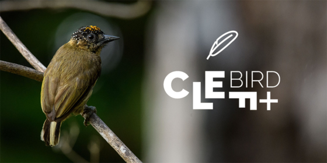

  
  <h1>Kaggle: Bird CLEF+ 2025</h1>
  
  

    Kaggle project to classify audio clips of birds and other species based on their calls
  

 

<!-- Badges -->

## Tools

---

 

<!-- Table of Contents -->

# :notebook_with_decorative_cover: Table of Contents

- [About the Project](#star2-about-the-project)
- [Details on Data](#bookmark_tabs-details-on-data)
- [Contact](#handshake-contact)
- [Acknowledgements](#gem-acknowledgements)

<!-- About the Project -->

## :star2: About the Project

Multilabel classification of audio tracks containing the sounds of various animals. Predict the likelihood that an animal is present within the audio tracks

## :bookmark_tabs: Details on Data

Data contains short recordings of individual bird, amphibian, mammal and insect sounds. Prediction is on a soundscape containing background noise and different animal sounds

## :handshake: Contact

Author: Martin Ho

Project Link: [Github](https://github.com/minimartzz/bird-clef-2025)

<!-- Acknowledgments -->

## :gem: Acknowledgements
